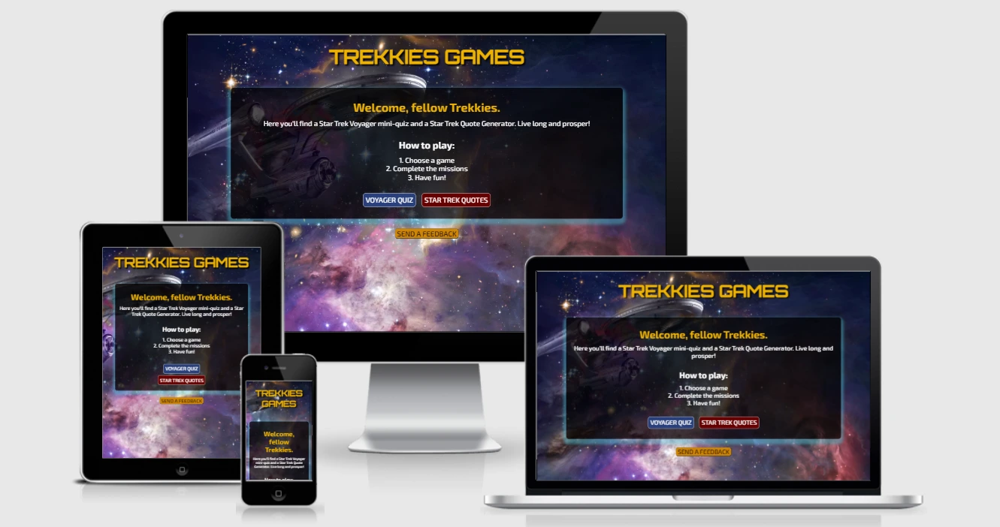

# Trekkies Games
[View the live project here](https://joyzadan.github.io/star-trek-voyager/)

Trekkies Games is a quiz and Star Trek quote generator application with an option to share your favourite quote on Twitter. It is dedicated to its legions of fans around the world, young and old alike.

## Table of Contents
* [Overview](#overview-1)
* [User Experience (UX)](#user-experience-ux-1)
* [Features](#features-1)
* [Technologies Used](#technologies-used-1)
* [Testing](#testing-1)
* [Deployment](#deployment--local-development)
* [Credits](#credits-1)
* [Acknowledgements](#acknowledgements-1)

## Overview
To quote [Space.com](https://www.space.com/31802-star-trek-space-tech.html), since viewers first heard the tagline, "... to boldly go where no man has gone before", "Star Trek has represented hope of what space -- 'the final frontier' -- can mean for humanity in a few centuries. 

Star Trek has significantly influenced society, science, technology and succeeding science fiction movies, books, television shows and has spawned online and offline communities of fans and followers.

[Supercluster](https://www.supercluster.com/editorial/star-treks-most-significant-legacy-is-inclusiveness) wrote, one of "Star Trek's most significant legacy: diversity". It added that, "from science to technology to our quest to live among the stars, Star Trek has influenced the way we think, the way we live our lives, and even the devices we use on a daily basis. But there’s one area where Star Trek’s influence is often overlooked: that of representation." It's creator, Gene Rodenberry, said: "The whole show was an attempt to say that humanity will reach maturity and wisdom on the day that it begins not just to tolerate, but to take a special delight in differences in ideas and differences in life forms."

Overall, Star Trek has been influential enough that [NASA](https://www.nasa.gov/) even wrote an article about it! Titled, ["The Science of Star Trek"](https://www.nasa.gov/topics/technology/features/star_trek.html), the article asked, "Is Star Trek really a science show, or just a lot of 'gee, whiz' nonsensical sci-fi? 

Star Trek is interesting and entertaining. This application, the Trekkies Games also aims to provide some entertainment and enjoyment for the user. 

## User Experience (UX)
### First Time Visitor Goals
* As a First Time Visitor, I want to be able to immediately understand the main purpose of the application, "Trekkies Games".
* As a First Time Visitor, I want to be able to understand how to play the games.
* As a First Time Visitor, I want to be able to choose what I want to do upon landing on the home page, play the quiz game or play with the quote generator.
* As a First Time Visitor, I want the pages to be responsive to be my device, no matter it's size.
### Returning Visitor Goals
* As a Returning Visitor, I want to be able to try my chance again at getting a higher score by being able to reload the game.
* As a Returning Visitor, I want to try see more quotes.
*  As a Returning Visitor, I want to be able to find out how much I know about Star Trek.
### Frequent Visitor Goals
* As a Frequent Visitor, I want to be able to share my favourite quotes on social media
* As a Frequent Visitor, I want to be able to give my feedback to the developer.

### Design
* Colour Scheme
- The main colours used on the site represent the colours of Star Trek: Black, yellow, blue and red. Additionally, colour green was used to indicate correct answers.
* Typography
- Orbitron font is used for the application logo as this is the closest to Star Trek "look" that's available from Google fonts. It is also used for the introduction message for each of the game page.
Orbitron is paired with Exo 2 font for the game content and for the buttons.
* Imagery
- The three images used for the application all represented the "look" of space, planets and nebulas. The home page image was superimposed by a png image of Star Trek Voyager spaceship from pngegg.

### Wireframes
- [Home page wireframe (mobile)](./assets/images/ux/mobile-home.webp)
- [Quiz wireframe - game page (mobile)](./assets/images/ux/mobile-quizgame.webp)
- [Quote Generator wireframe (mobile)](./assets/images/ux/mobile-quotetweet.webp)
- [Home page wireframe (desktop)](./assets/images/ux/desktop-home.webp)
- [Quiz wireframe (desktop)](./assets/images/ux/desktop-quizgame.webp)
- [Quote Generator wireframe (desktop)](./assets/images/ux/desktop-quotetweet.webp)

### Features
Trekkies Games is highly interactive and encourages users to click on their choices to play a game.

Trekkies Games has two main features: a quiz game on Voyager where fans can test their knowledge of the seven season show and famous Star Trek quotes generator with the option to share their favourite quote on Twitter. The game also allows for and encourages user feedback by having a button that clearly states, "send a feedback".

## Technologies Used
### Languages Used
*  HTML5
*  CSS
* JavaScript

### Frameworks, Libraries and Programmes Used
- Google Fonts used to import the Montserrat and Fira Sans fonts into the style.css file and are used on all pages of the application
- Lineicons used for the twitter button on the quotes page.
- Photoshop was used to optimize the home/ landing page, the quiz and for the quotes page. 
- Online-Convert was used to convert the png images to webp
- Adobe Stock - the developer has an existing account with Adobe Stock and all images used on the site are all licensed for use.
- Git was used for version control.
- GitPod was used as online IDE for GitHub and the terminal was used to add and commit to Git and push to GitHub.
- GitHub was and is being used as repository of the project source code and for deploying the site/ application.
- Balsamiq was used to create the wireframes for Trekkies Games project.
- Favicon was used to create favicon.
- Chrome DevTools was used to test the code and debug the code during the development process.
- Microsoft Edge DevTools was used to test the code and debug the code during the development process.
- Safari DevTools was used to test the code and debug the code during the development process.
- a11y was used to test accessibility
- W3C Markup Validation was used to test HTML code
- W3C CSS Validation Service was used to test CSS code
- JSHint was used to test JavaScript code
## Testing
Testing was carried out at every point in the development to check for issues with the code, responsiveness, design, interactivity and accessibility. The developer tools used primarily were Chrome DevTools, with the console playing a key factor in testing and debugging.

### Bugs and Solutions
#### Solved Bugs
 - Users were able to increment both the correct and wrong answers after the game had ended. This was solved by adding this [line of code to quiz.js](./assets/images/bugs/increment-scores.webp)
 - Modal container's close me button not showing on large screen. This was solved by adjusting the feedback form's font sizing.
 - Space between a font number and the rem caused sole error on W3C's CSS Validation test. This was easily resolved by correcting the typo.
 - Including the main.js script tag on the 404 page caused lighthouse testing errors. Fixed by removing the link.
 - a11y testing showed problems with font and background color contrast. This was solved by changing background of modal container and the quiz gameboard to black.
 - Several trailing spaces showed up on JSLint testing. These were resolved by deleting said spaces.
 - Unnecessary semicolons and unused variables also showed up on jshint testing. These were deleted.
 - Two errors were also discovered following the Nu Validator testing - a typo on the word method and the valid attribute of required on the input submit button. These were corrected promptly.
 - The quotation mark icon was overlapping with the quotes when viewed on bigger screens after being loaded dynamically. This was resolved by adjusting the font sizing.
 - A JSLint testing showed warning for using ++ for the increment function. This was resolved by using + 1 instead.
 - The toggleDivs function caused issues with the quiz container not being removed after the quiz ended. The originally idea was to:
 first show the instructions container when the page is loaded. Second, it will then be removed when the player presses the start quiz button. Third, after the quiz had ended, the plan was to then dynamicslly remove the quiz container and replace it with a new container for results. The toggleDiv function seemed to have locked the quiz container to display block and after multiple tries for nearly a day, this problematic function was removed and replaced by hiding the content of the quiz container and replacing it with the results content instead.
 - During development, I had the hardest time to capture the correct and wrong answers selected by the user. The solution was found from WebDev simplified's tutorial and in particular, the use of array.from to iterate through an array.

### Remaining Bugs
There are no remaining known bugs.

### Validation Results

The W3C Markup Validator and the W3C CSS Validator were used to test and validate every all six pages of 
the Trekkies Games interactive project to ensure that there were no syntax errors in the code. Chrome's 
Lighthouse DevTool was also used to test for Performance, Accessibility, Best Practices and SEO. 
JSHint was used to test JavaScript code quality.

* W3C Markup Validator Test Results: 
    - [Home page](./assets/images/validation/nuhtml-index.webp)
    - [Quiz page](./assets/images/validation/nuhtml-quiz.webp)
    - [Quotes page](./assets/images/validation/nuhtml-quotes.webp)
    - [Quotes page](./assets/images/validation/nuhtml-redirect.webp)
* W3C CSS Validator Test Results:
    - [Results](./assets/images/validation/css-validation.webp)
    - [Warning](./assets/images/validation/css-warnings.webp)
* JSHint Linting Results:
    - [main.js](./assets/images/validation/jshint-mainjs.webp)
    - [quiz.js](./assets/images/validation/jshint-quizjs.webp)    
    - [quote.js](./assets/images/validation/jshint-quotejs.webp)
* Lighthouse Test Results:
    - [Mobile - home page](./assets/images/validation/mobile-index.webp)
    - [Mobile - quiz page](./assets/images/validation/mobile-quiz.webp) 
    - [Mobile - quotes page](./assets/images/validation/mobile-quotes.webp)   
    - [Mobile - 404 redirect page](./assets/images/validation/mobile-redirect.webp)
    - [Desktop - home page](./assets/images/validation/desktop-index.webp)
    - [Desktop - quiz page](./assets/images/validation/desktop-quiz.webp)
    - [Desktop - home page](./assets/images/validation/desktop-quotes.webp)
    - [Desktop - home page](./assets/images/validation/desktop-redirect.webp)
* a11y Color Contrast Accessibility for the Visually Impaired Validator Results:
    - [Home page](./assets/images/validation/a11y-index.webp)      
    - [Quiz page](./assets/images/validation/a11y-quiz.webp)
    - [Quotes page](./assets/images/validation/a11y-quotes.webp)
    - [404 Redirect page](./assets/images/validation/a11-redirect.webp)

### Testing User Stories from User Experience (UX) Section
#### First Time Visitor Goals
* As a First Time Visitor, I want to be able to immediately understand the main purpose of the application, "Trekkies Games".
    - Upon landing on the site, the user is immediately made aware of what the application is about. Beneath the logo is the welcome message and message about what they will find on the site/ game.
    [Screenshot of home page](./assets/images/ux/trekkies-rules.webp)
* As a First Time Visitor, I want to be able to understand how to play the games.
     - Aside from the welcome message on the home page, the players are presented with the [quiz rules on the quiz page](./assets/images/ux/trekkies-rules.webp)
* As a First Time Visitor, I want to be able to choose what I want to do upon landing on the home page, play the quiz game or play with the quote generator.
The players have the choice to go to the [quiz game or to the quote generator on the home page](./assets/images/ux/trekkies-intro.webp). They are also able to navigate back to the home page by clicking the [game logo](./assets/images/ux/trekkies-logo.webp) on any page.
* As a First Time Visitor, I want the pages to be responsive to be my device, no matter it's size.
The whole project has been developed for mobile first and all pages are fully responsive across all devices: [Galaxy Fold](./assets/images/ux/responsive-galaxyfold.webp); [iphone12](./assets/images/ux/responsive-iphone12.webp); [midsized screens](./assets/images/ux/responsive-midsized.webp); [large screens](./assets/images/ux/responsive-large.webp).
#### Returning Visitor Goals
* As a Returning Visitor, I want to try see more quotes.
The players are able to load more quotes by clicking the [new quote button](./assets/images/ux/feature-quotes.webp).
*  As a Returning Visitor, I want to be able to find out [how much I know about Star Trek](./assets/images/ux/quiz-score.webp) and by being able to replay the quiz. 
#### Frequent Visitor Goals
* As a Frequent Visitor, I want to be able to share my favourite quotes on social media
The users are able to do just that at the click of the twitter button. They are also able to load a new quote by clicking on the [new quote button](./assets/images/ux/quotes-buttons.webp); [tweet sample](./assets/images/ux/quotes-tweet.webp)
* As a Frequent Visitor, I want to be able to give my feedback to the developer.
The [feedback form](./assets/images/ux/trekkies-modal.webp) allows the users to send the message and feedback about the games. 

#### Further Testing
During the development stage, ongoing testings were carried out for responsiveness, functions and console errors. The project under its development were tested using different DevTools (Chrome, Safari and Microsoft Edge). The pages were physically viewed on different devices available to the developer to test for links, functions and responsiveness. 

Friends, family members and colleagues were also requested to play the games and inform the developer of any broken links, bugs or glitch they may encounter. No issues were reported and some have already expressed interest for additional questions and more mini games to be added as soon as reasonable.
 
### Future Developments
* Planned future developments include:
    - adding more questions to the quiz game
    - add another game such as a rescue mission 
    - additional developments may also include a find Trekkies in your area 

## Deployment & Local Development
### Deployment
* The project was deployed to GitHub Pages using the following steps:
1. Login or signup to GitHub and locate the GitHub Repository [GitHub Repository](https://github.com/JoyZadan/star-trek-voyager).
2. On the repository page, navigate to Settings and click on it.
3. Within the Settings page, under Source choose Branch: main, then /root and click Save.
4. After about a minute, the site is published.

### Local Development
* How to Fork 
To fork the repository, use the following steps:
1. Login or signup to Github and locate the repository.
2. Click the Fork button in the top right corner

### Making Local Clone
1. Login or signup to GitHub and locate the GitHub Repository [GitHub Repository](https://github.com/JoyZadan/star-trek-voyager).
2. Under the repository name, click "clone" or "download".
3. To clone the repository using HTTPS, under "Clone with HTTPS", copy the link.
4. Open the terminal in your preferred code editor and change the current working directory to the location you want to use for the cloned directory.
5. Type git clone, and then paste the URL you copied in Step 3. 
6. Press Enter. Your clone will be created.

## Credits
### Code
* Credit and thanks belong to numerous tutorials on YouTube by seasoned developers.
    - Thanks to FlorinPop's [Create a Modal (Popup) with HTML/CSS and JavaScript](https://www.youtube.com/watch?v=XH5OW46yO8I);
    [Code:](./assets/images/snippets/florinpop-js.webp)
     - Thanks to WebDev Simplified's [Build A Quiz App With JavaScript](https://www.youtube.com/watch?v=riDzcEQbX6k);
    [Code:](./assets/images/snippets/webdevsimplified-js.webp)  
    - Thanks to NetNinja's Udemy course for the code snippet on animating scores [Code:](./assets/images/snippets/netninja-js.webp) 
    - Also thanks to Jacinto Wong's Udemy course for the code snippet on how to Tweet quotes at one click of a button [Code:](./assets/images/snippets/jacintowong-js.webp)
    
### Content
* The quiz questions written by the developer, based on the knowledge of having watched the Star Trek shows previously. The quotes were gathered from Inc.com's [50 Star Trek Quotes Inspiring You to Boldly Go Into Your Future](https://www.inc.com/kevin-daum/50-star-trek-inspiring-you-to-boldly-go-into-your-future.html). Credit for the content (questions and quotes) ultimately belongs to Star Trek and Paramount. 

### Media
* All images were licensed from Adobe Stock
* PNG - [pngegg](https://www.pngegg.com/) for the Voyager spaceship png

## Acknowledgements
Thanks to Jo Bowden and the team at South Devon College for your help with this project, it's really appreciated.
Special mention and thanks to my mentor, Dario Carrasquel, for his support, invaluable insights and patience with me 
on this project.

## Copyrights
[Joy Zadan](www.linkedin.com/in/joy-araneta-zadan)

