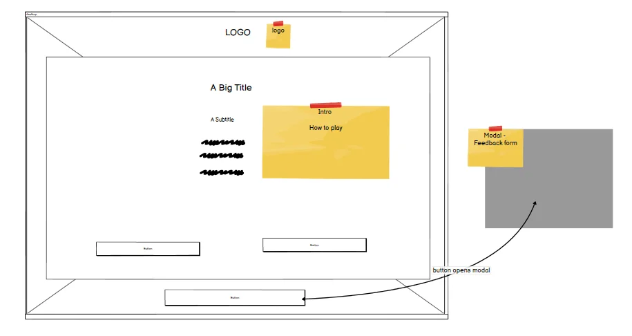

# Trekkies Games
[View the live project here](https://joyzadan.github.io/star-trek-voyager/)

Trekkies Games is a quiz and Star Trek quote generator application with an option to share your favourite quote on Twitter. It is dedicated to its legions of fans around the world, young and old alike.

## Table of Contents
### [Overview](#overview-1)
### [User Experience (UX)](#user-experience-ux-1)
### [Features](#features-1)
### [Technologies Used](#technologies-used-1)
### [Testing](#testing-1)
### [Deployment](#deployment-1)
### [Credits](#credits-1)
### [Acknowledgements](#acknowledgements-1)

## Overview
To quote [Space.com](https://www.space.com/31802-star-trek-space-tech.html), since viewers first heard the tagline, "... to boldly go where no man has gone before", "Star Trek has represented hope of what space -- 'the final frontier' -- can mean for humanity in a few centuries. 

Star Trek has significantly influenced society, science, technology and succeeding science fiction movies, books, television shows and has spawned online and offline communities of fans and followers.

[Supercluster](https://www.supercluster.com/editorial/star-treks-most-significant-legacy-is-inclusiveness) wrote, one of "Star Trek's most significant legacy: diversity". It added that, "from science to technology to our quest to live among the stars, Star Trek has influenced the way we think, the way we live our lives, and even the devices we use on a daily basis. But there’s one area where Star Trek’s influence is often overlooked: that of representation." It's creator, Gene Rodenberry, said: "The whole show was an attempt to say that humanity will reach maturity and wisdom on the day that it begins not just to tolerate, but to take a special delight in differences in ideas and differences in life forms."

Overall, Star Trek has been influential enough that [NASA](https://www.nasa.gov/) even wrote an article about it! Titled, ["The Science of Star Trek"](https://www.nasa.gov/topics/technology/features/star_trek.html), the article asked, "Is Star Trek really a science show, or just a lot of 'gee, whiz' nonsensical sci-fi? 

Star Trek is interesting and entertaining. This application, the Trekkies Games also aims to provide some entertainment and enjoyment for the user. 

## User Experience (UX)
### First Time Visitor Goals
* As a First Time Visitor, I want to be able to immediately understand the main purpose of the application, "Trekkies Games".
* As a First Time Visitor, I want to be able to understand how to play the games.
* As a First Time Visitor, I want to be able to choose what I want to do upon landing on the home page, play the quiz game or play with the quote generator.
* As a First Time Visitor, I want the pages to be responsive to be my device, no matter it's size.
### Returning Visitor Goals
* As a Returning Visitor, I want to be able to try my chance again at getting a higher score by being able to reload the game.
* As a Returning Visitor, I want to try see more quotes.
*  As a Returning Visitor, I want to be able to find out how much I know about Star Trek.
### Frequent Visitor Goals
* As a Frequent Visitor, I want to be able to share my favourite quotes on social media
* As a Frequent Visitor, I want to be able to give my feedback to the developer.

### Design
* Colour Scheme
- The main colours used on the site represent the colours of Star Trek: Black, yellow, blue and red. Additionally, colour green was used to indicate correct answers.
* Typography
- Orbitron font is used for the application logo as this is the closest to Star Trek "look" that's available from Google fonts. It is also used for the introduction message for each of the game page.
Orbitron is paired with Exo 2 font for the game content and for the buttons.
* Imagery
- The three images used for the application all represented the "look" of space, planets and nebulas. The home page image was superimposed by a png image of Star Trek Voyager spaceship from pngegg.

### Wireframes
- 
- 
- 
- 
- 
- 
### Trekkies Games Flow Charts
### Features

Trekkies Games has two main features: a quiz game on Voyager where fans can test their knowledge of the seven season show and famous Star Trek quotes generator with the option to share their favourite quote on Twitter. The game also allows for and encourages user feedback by having a button that clearly states, "send a feedback".

## Technologies Used
### Languages Used
#### HTML5
#### CSS
#### JavaScript

### Frameworks, Libraries and Programmes Used
- Google Fonts used to import the Montserrat and Fira Sans fonts into the style.css file and are used on all pages of the application
- Lineicons used for the twitter button on the quotes page.
- Photoshop was used to optimize the home/ landing page, the quiz and for the quotes page. 
- Online-Convert was used to convert the png images to webp
- Adobe Stock - the developer has an existing account with Adobe Stock and all images used on the site are all licensed for use.
- Git was used for version control.
- GitPod was used as online IDE for GitHub and the terminal was used to add and commit to Git and push to GitHub.
- GitHub was and is being used as repository of the project source code and for deploying the site/ application.
- Balsamiq was used to create the wireframes for Trekkies Games project.
- Favicon was used to create favicon.
- Chrome DevTools was used to test the code and debug the code during the development process.
- Microsoft Edge DevTools was used to test the code and debug the code during the development process.
- Safari DevTools was used to test the code and debug the code during the development process.
- a11y was used to test accessibility
- W3C Markup Validation was used to test HTML code
- W3C CSS Validation Service was used to test CSS code
- JSHint was used to test JavaScript code
## Testing
Testing was carried out at every point in the development to check for issues with the code, responsiveness, design, interactivity and accessibility. The developer tools used primarily were Chrome DevTools, with the console playing a key factor in testing and debugging.

### Bugs and Solutions
### Remaining Bugs
### Validation Results

The W3C Markup Validator and the W3C CSS Validator were used to test and validate every all six pages of 
the Trekkies Games interactive project to ensure that there were no syntax errors in the code. Chrome's 
Lighthouse DevTool was also used to test for Performance, Accessibility, Best Practices and SEO. 
JSHint was used to test JavaScript code quality.

* W3C Markup Validator Test Results: 
    - [Home page](./assets/images/validation/nuhtml-index.webp)
    - [Quiz page](./assets/images/validation/nuhtml-quiz.webp)
    - [Quotes page](./assets/images/validation/nuhtml-quotes.webp)
    - [Quotes page](./assets/images/validation/nuhtml-redirect.webp)
* W3C CSS Validator Test Results:
    - [Results](./assets/images/validation/css-validation.webp)
    - [Warning](./assets/images/validation/css-warnings.webp)
* JSHint Linting Results:
    - [main.js](./assets/images/validation/jshint-mainjs.webp)
    - [quiz.js](./assets/images/validation/jshint-quizjs.webp)    
    - [quote.js](./assets/images/validation/jshint-quotejs.webp)
* Lighthouse Test Results:
    - [Mobile - home page](./assets/images/validation/mobile-index.webp)
    - [Mobile - quiz page](./assets/images/validation/mobile-quiz.webp) 
    - [Mobile - quotes page](./assets/images/validation/mobile-quotes.webp)   
    - [Mobile - 404 redirect page](./assets/images/validation/mobile-redirect.webp)
    - [Desktop - home page](./assets/images/validation/desktop-index.webp)
    - [Desktop - quiz page](./assets/images/validation/desktop-quiz.webp)
    - [Desktop - home page](./assets/images/validation/desktop-quotes.webp)
    - [Desktop - home page](./assets/images/validation/desktop-redirect.webp)    

### Testing User Stories from User Experience (UX) Section
### Further Testing
### Future Developments

## Deployment
### GitHub Pages

## Credits
### Code
### Content
* PNG - pngegg for the Voyager spaceship png
### Media

## Acknowledgements

## Copyrights

